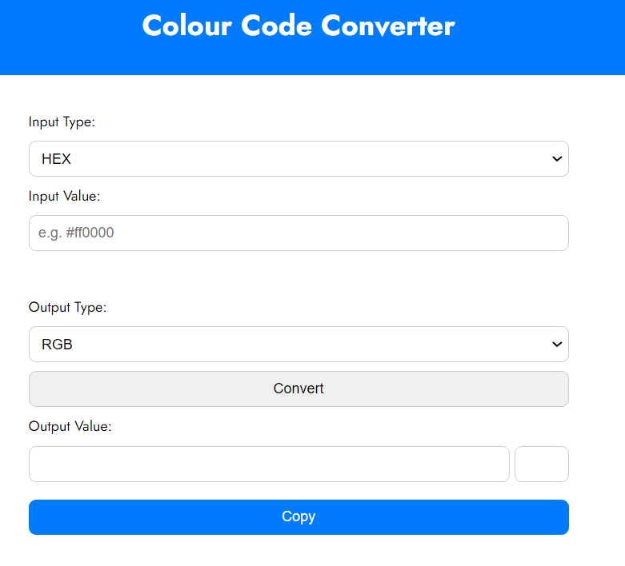
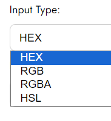
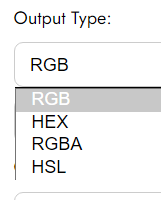
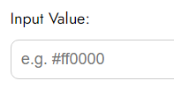
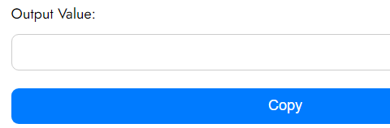
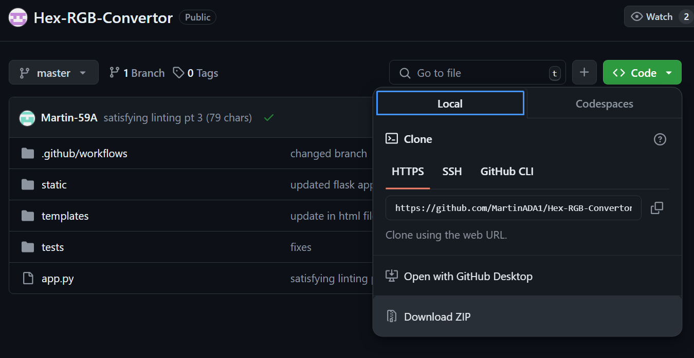
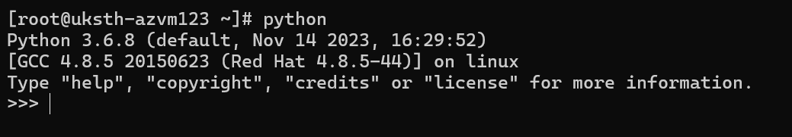
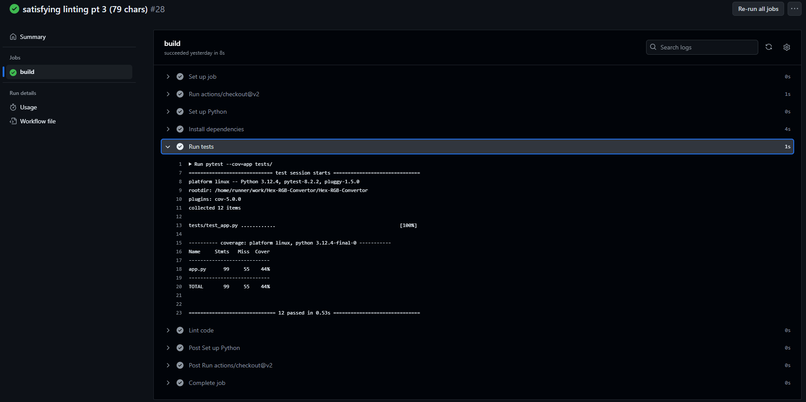

# Colour Code Converter

Hey there, this repo contains source code for a Hex-RGB code converter created as part of the assignment for the Software Quality assurance module.



Above shows the user interface for the app.

## Product Description

This Colour Code Converter can convert between 4 popular colour code formats:
1. HEX
2. RGB
3. RGBA
4. HSL

   

As shown above, there are four input values and four output values, the UI won't let you have the same input and output value as that would result in the same value being returned.

The following is the where the value can be inputted:




At the bottom of the page is where the converted colour code is outputted.



There is a copy button that easily allows users to copy the output value.


## Team Description

This project was completed by:
- Martin Nkama
- Ali Al-baity

Martin Nkama mainly focused on the logic of the program while Ali Al-baity mostly focused on documentation and research. 
Despite these roles, both supported each other and sometimes wore different hats.

## Tools Used

This app was mainly built off of the **flask** framework which allows developers to easily build web applications using python.

Other tools/resources used include:
- **PyTest Module** - used to test application logic
- **Google Fonts** - open source library by Google used in styling of the UI
- **GitHub Workflows** - used to automate checks for each pull request/push. The checks include running tests and lint format checking.

## Running the Application

To run the application locally you follow the instructions below.

#### 1. Download source code
You will first need to ensure you download and extract the source code zip file.
This could either be done by clicking this [link](https://github.com/MartinADA1/Hex-RGB-Convertor/archive/refs/heads/master.zip) or following the image below:



#### 2. Install Python
Once you've downloaded the source code you need to install python if you don't already have it installed.
To check if you have python installed enter the following in the terminal of your computer:

```commandline
python
```

Expect the following output or similar if you have it installed:



To download python find the latest stable release [here](https://www.python.org/downloads/).
Any version from `v3.x.x` should be fine.

#### 3. Install dependencies
After installing python you would need to install the dependencies. The only dependency you will need to install is flask. You could easily do that by pasting the following in the terminal:

```commandline
pip install flask
```

#### 4. Start Application

After this, in the terminal, from the root folder, `/Hex-RGB-Converter/` paste in the following command to start the application:

```commandline
python app.py
``` 

#### 5. Open the UI
Once that's done, go to [http://127.0.0.1:5000/](http://127.0.0.1:5000/) to interact with the application.

## Project Workflow

Together we mainly developed using an agile methodology without a set sprint length.
This meant we both had our set tasks, and we would set out to do them, we would occasionally catch up on an ad-hoc basis.
Our main ceremony was standup which we did about bi-weekly. This allowed us to focus on development and not get too distracted
by semantics while ensuring we keep each other updated on progress/blockers.

## Testing Methodology

The Color Code Converter application was rigorously tested to ensure its stability and performance. Here are the different types of testing that were conducted at various stages of the development process:

- Manual Smoke Testing: Each time a pull request (PR) was made, contributors performed manual smoke tests to verify the application's build. This involved running the app, entering color codes for conversion, and checking that all core functionalities were operational. The smoke tests followed a structured checklist to compare expected outcomes with actual results.

- Sanity Testing: After implementing or fixing features, sanity tests were conducted to confirm that the recent changes did not introduce any new issues. This type of narrow regression testing involved running the application and using the newly added or modified features to ensure they worked correctly.

- Unit Testing: Automated unit tests were created for each conversion function to validate their correctness. These tests were written using the pytest framework and checked the functions' behavior with various input values to ensure accurate conversions.

Automated tests were incorporated into the continuous integration (CI) pipeline. This setup ensured that all tests were executed with every PR and re-run automatically whenever new changes were pushed. This approach maintained high code quality and ensured the application's stability throughout the development process.

### Testing Screenshots

`Pytest tests running locally in the terminal`


`Pipeline tests automated workflow on GitHub`



## Coding Best Practices

We maintained various different coding best practices to ensure our code was easily legible and conventional.

#### 1. Indentation

We always ensured we used 4-spaces for indentation which is mandatory in python. We also ensured we don't have too many
code blocks nested in each other causing huge indentations which make the code difficult to read.

#### 2. Max Line Length

We always ensured not to exceed 79 characters in a sing le line, this is consistent with the 
PEP 8 standard for python best practices and conventionality.

#### 3. Use of Linter

We ensure to always lint and format our code to keep code styles consistent within the codebase
and consistent with conventional python codebases

#### 4. Blank Lines

We have been very deliberate with where we use blank lines. We always ensure to have 2 blank-lines around classes
and 1 blank line in between methods. We occasionally use a blank line inside a function
to demonstrate logical separations.

## CI Pipelines

To set up continuous integration we set up a build yaml script file that runs some tests on every
push/pull request. To do this, we follow the following steps:
1. install python in the GitHub runtime environment
2. run lint on the code
3. run all the tests

This ensures all PRs have been checked before getting merged in.

