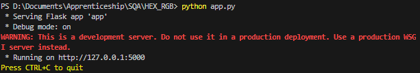

# Colour Code Converter

- A web application for converting between various color codes (HEX, RGB, RGBA, HSL) with a user-friendly interface to display the converted color and allow copying of the converted code.

## <ins>Project Description</ins>

This project is a color code converter that enables users to convert between different color codes (HEX, RGB, RGBA, HSL). The application provides a simple and intuitive interface for users to input color values and see the converted results in real-time, including a visual representation of the color.

### **Features:**
- Convert between HEX, RGB, RGBA, and HSL color codes.
- Display the converted color.
- Copy the converted color code to the clipboard.
- Responsive UI design.

## <ins>Instructions to Run and Use the Application</ins>

### How to Clone the Repository

Navigate to the application's public GitHub repository via this link: [`https://github.com/martin-nkama/Colour-Code-Convertor`](https://github.com/martin-nkama/Colour-Code-Convertor)

Clone the repo locally by running `git clone ` followed by the HTTPS or SSH link

### How to Start the Application

Open the code base and install dependencies:
```
pip install Flask pytest
```

Run the application:
```
python app.py
```

Access the application at the link given in the terminal in your web browser. `Link Example`


And now the webpage should be up! `Webpage Screenshot`


